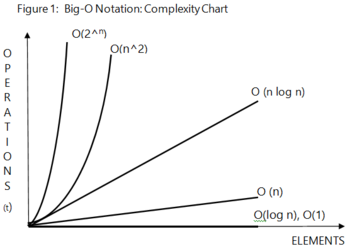
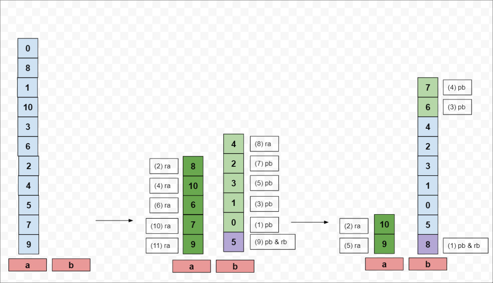

Data structure used
- Deques (doubly ended queues) in the form of doubly linked lists. Included functions for creation, adding (back & front), deletion/popping (back & front), counting sizes.
- Included a stack (single deque) & stacks (double deque) typedef. Double deques are used to mimic environment of subject question.
- To complement the 11 operations allowed, added 11 functions to mimic what the actual operations do to the stacks, (i.e. sa, sb, ss, pa, pb, ra, rb…).

Sorting algorithms
- Quadratic sorting algorithms are a no go - i..e bubble/ selection/ insertion due to n2 time complexity.
- Second best sorting algorithms are linearithmic/comparison sorts, e.g. merge or quick sorts with nlogn time complexity. 
- There are O(n) sorting algorithms, e.g. radix sort. However, due to nature of a stack data structure, it is not possible to achieve O(n), as movements within/between stacks are merely rotation, or popping.

Algorithm implemented (O(nlogn))
- A combination of:
  - Quick sort's partitioning, and
  - Merge sort's recursive merging
- The recursive function involves
  1. Defining the pivot to be used,
  2. Partitioning the list to (i) amounts less than, and (ii) greater than the pivot
  3. Recursively call function to solve (i) and (ii), i.e. partitioining until base case achieved
  4. Merging partitions (i) and (ii)
- Several considerations are involved, i.e.
  - Defining the pivot is key for quick sort's partitioning. The ideal situation is to have the pivot be the median of the stack/array we are sorting so that we have even partitioning.
	But, randomly choosing an integer in an array will usually also result in a good enough sorting time as the likelihood of a bad pivot(s) (which may result in O(n2) being chosen is very unlikely.
  - Quick sort in an array uses variables to temporarily hold amounts to be partitioned, and naturally uses array indexing to swap partitioning amounts.
  - As we are dealing with a stack, we would have to imagine the following:
    (I) How to keep track and partition amounts greater than pivot?
    (II) How to keep track and partition amounts lesser than pivot?
    (III) How to keep track of pivot so that we can place it in the middle of (I) and (II)?

  - Actions above are repeated until base case is met
    - Base case is when the stack has len 1, however there are optimisation procedures to make sure a separate set of instructions are executed if len <= 3
  - After sort ends, the above instructions to partition are executed again (but in reversed)

Others
- Operations are stored in a list

Optimisations
(i) Using median to partition evenly
(ii) Two types of sorts
	- Using median as PIVOT only once - no need to pb rb/ pa ra to keep track of median, only require one step, i.e. rb/ ra
	- Using median as PIVOT throughout - good when number of elements are huge
(iii) Removing duplicate operations
	- when 2 SAs/SBs/SSs are seen side by side, remove them from the operations list
	- when PB and PA is seen side by side, remove from operations list
	- etc
(iv) Make efficient movements
	- E.g. if first stack is size 5, and 4 sets of SA instruction is seen, this can be summarised to one SSA operation

Downfalls
(i) Very memory intensive
	- all operations are stored in a list, 
    	- can at least be made efficient by using a singly linked list instead of a doubly linked list (no need extra prev pointer)
  	- merge_sort is configured to return list, 
    	- can instead iterate and copy list once and just use quick sort.
    	- Mainly used when trying to identify median of stack (of size len)